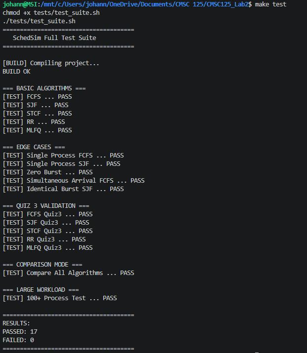
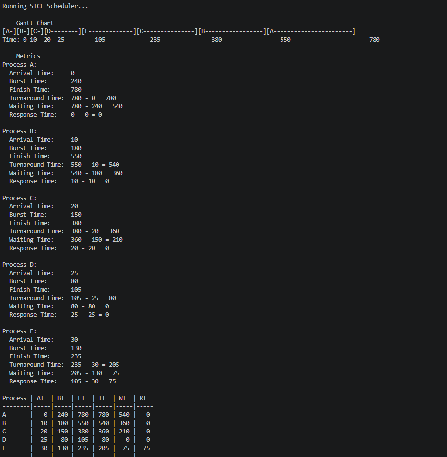
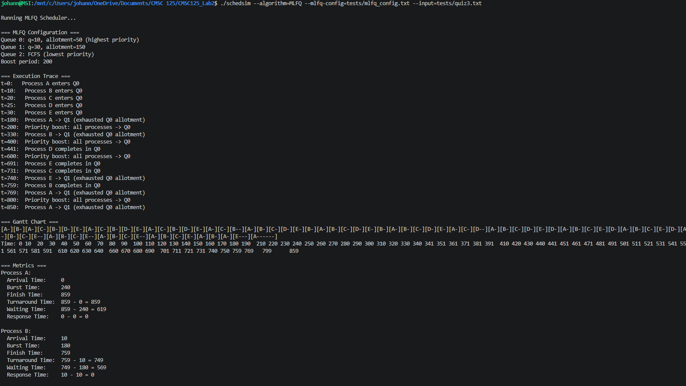
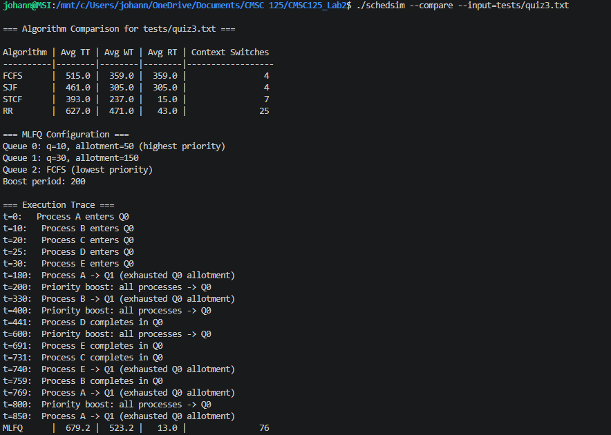
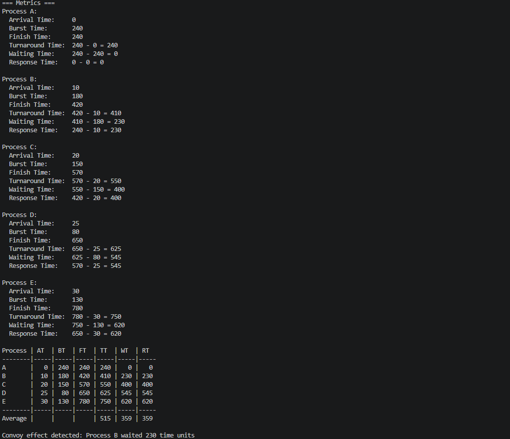

# SchedSim: CPU Scheduling Simulator

## Group Members
- Renz Rendel De Arroz
- Johann Ross Yap

## Project Overview
SchedSim is a discrete-event CPU scheduling simulator implemented in C. It demonstrates various scheduling algorithms used by operating systems to manage process execution. The simulator accepts process workloads and outputs detailed metrics and Gantt charts for performance analysis.

## Features
- **FCFS (First-Come, First-Served):** Non-preemptive scheduling in arrival order.
- **SJF (Shortest Job First):** Non-preemptive scheduling prioritizing shorter bursts.
- **STCF (Shortest Time-to-Completion First):** Preemptive version of SJF.
- **RR (Round Robin):** Preemptive scheduling with configurable time quantums.
- **MLFQ (Multi-Level Feedback Queue):** Dynamic priority-based scheduling with multiple queues, allotment tracking, and priority boosting.
- **Comparison Mode:** Compare performance metrics across all algorithms for a single workload.
- **Gantt Charts:** Visual representation of execution timelines.
- **Detailed Metrics:** Per-process and average Turnaround Time (TT), Waiting Time (WT), and Response Time (RT).

## Compilation
To compile the simulator, run the following command in the root directory:
```bash
make all
```

## Usage
Run the simulator using the following command structure:
```bash
./schedsim --algorithm=<ALGORITHM> --input=<WORKLOAD_FILE> [options]
```

### Options:
- `--algorithm=[FCFS|SJF|STCF|RR|MLFQ]`: Specify the scheduling algorithm.
- `--input=<file>`: Path to the process workload file.
- `--processes="PID:AT:BT,..."`: Define processes directly via command line.
- `--quantum=<N>`: Time quantum for Round Robin (default: 30).
- `--mlfq-config=<file>`: Configuration file for MLFQ parameters.
- `--compare`: Run all algorithms on the same workload for comparison.

### Example Commands:
```bash
# Run FCFS on a workload file
./schedsim --algorithm=FCFS --input=tests/quiz3.txt

# Run RR with a quantum of 50
./schedsim --algorithm=RR --quantum=50 --input=tests/workload1.txt

# Compare all algorithms
./schedsim --compare --input=tests/quiz3.txt
```

## Input Format
Workload files should follow this format:
```text
# PID ArrivalTime BurstTime
A 0 240
B 10 180
C 20 150
```

## Testing
To run the automated test suite:
```bash
make test
```

## Implementation Notes
- **MLFQ Design:** Our MLFQ implementation uses 3 priority levels with decreasing priority and increasing (or infinite) time quantums. It includes a priority boost mechanism every 200 time units to prevent starvation and allotment tracking to prevent gaming the scheduler.
- **STCF Logging:** The simulator logs both preemptions and resumptions for STCF, allowing for a clear trace of execution for preemptive jobs.
- **Metrics Calculation:** Detailed formulas are provided in the output to show how TT, WT, and RT are derived for each process.

## Simulation Results & Screenshots

### 1. Automated Test Suite
The simulator includes a comprehensive test suite that verifies the correctness of all scheduling algorithms against known workloads and edge cases.


### 2. Algorithm Execution & Gantt Charts
Each algorithm generates detailed execution logs and Gantt charts. Below are examples of STCF and MLFQ execution.

**STCF Gantt Chart (Preemptive SJF):**


**MLFQ Execution Trace & Gantt Chart:**
The MLFQ implementation demonstrates priority demotion and periodic priority boosting.


### 3. Comparative Analysis
The `--compare` mode allows for a direct performance comparison between all algorithms on the same workload.


### 4. Special Case: FCFS Convoy Effect
The simulator identifies specific scheduling phenomena, such as the convoy effect in FCFS.

